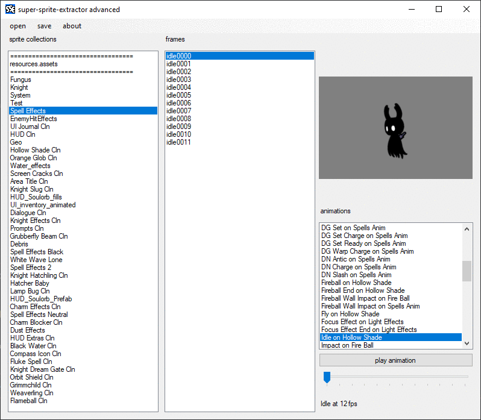

### sse-adv gui for tk2d

[DOWNLOAD](https://github.com/nesrak1/sseadv/releases)

this was only tested on hollow knight. I don't know if it works on other tk2d games.

the plan was to get this working with regular unity sprites as well but I never added that when I made this.

#### features:

along with viewing sprites and animations, you can also export a whole spritesheet, animation, or single sprite to a folder/png. you can also import a whole spritesheet or animation.

#### how to use:

**open level or sharedassets files with the open option**. one file opens a file you select, and all files open all level and sharedassets files in a folder. choosing automatically will try to find your game installation automatically and open a scene list. manually will let you choose the file yourself.

**save sprites, sheets, and animations to pngs with the save option**. make sure to have whatever you want to save selected in the main form before you use this.

**modify spritesheets with the edit option**. open the aaaaa_info.txt file that was created next to your exported sprites and look for an \_edit.png file once this is done.